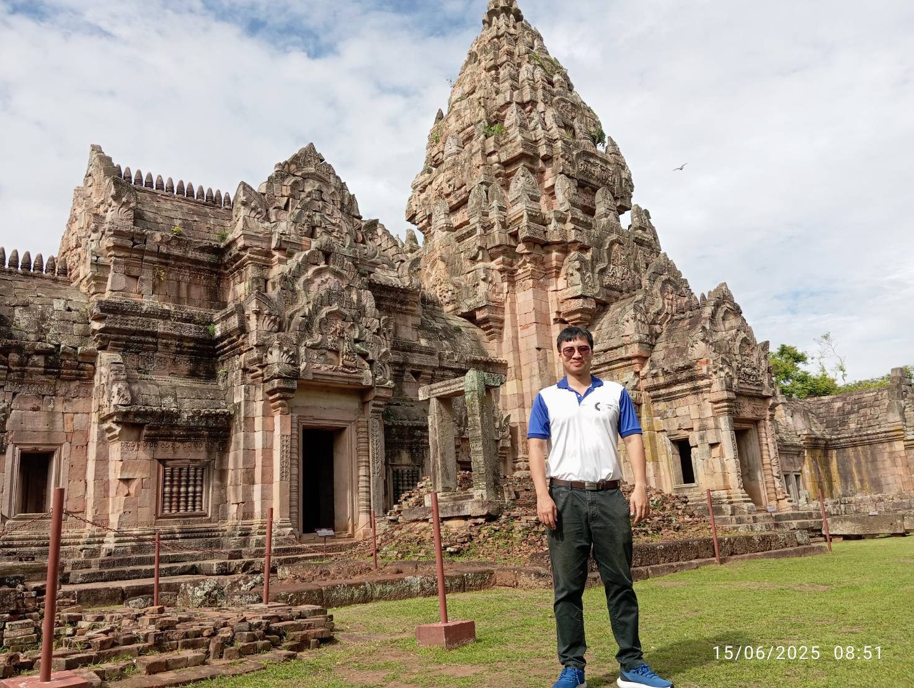

<!-- # About Me -->

<!-- 
TODO:
1. Change photo
-->

{ loading=lazy width="500" }

Hi, I'm Norawit Nangsue — a Thai–US dual citizen based in Bangkok, Thailand. I specialize in software development, with backgrounds in robotics, electrical, and computer engineering. I'm eager to innovate autonomous intelligence to mitigate the world labor shortage crisis and improving people's lives.

### Personal Research Journey
My research interests lie in the field of Optimal Control and its applications. I have devoted significant time to studying this area, beginning with the foundational text Optimal Control Theory: An Introduction by Donald E. Kirk. Although it is an introductory book, it left a strong impression on me—demonstrating that optimal solutions can, in some cases, be derived analytically without the aid of a computer. Two major frameworks—Euler-Lagrange equations and Pontryagin’s Minimum Principle—stand out as pillars of classical optimal control. Their mathematical elegance continues to inspire me and serves as a reminder of the power and beauty of analytical methods.

In my master’s thesis, I initially applied bicycle kinematics to model the system. However, my advisor encouraged me to explore the dynamics more deeply, particularly considering the effects of slipping and skidding. This shift motivated me to bring my self-studied knowledge of trajectory optimization into practice. While optimizing a unicycle model using direct collocation is relatively straightforward, applying the same method to a vehicle operating in a drifting state presents a much greater challenge—the solver often fails to find any feasible solution at all.

In fact, a solution does exist that allows the vehicle to park laterally—if a human can perform such a maneuver, so can an algorithm. This suggests that the challenge lies not in the existence of a solution, but in the choice and design of the method used to find it. This realization has led me to develop a strong interest in nonlinear control theory, differential geometric manifolds, and Lie algebra, as I believe these mathematical tools are key to unlocking more robust and intelligent motion planning strategies.