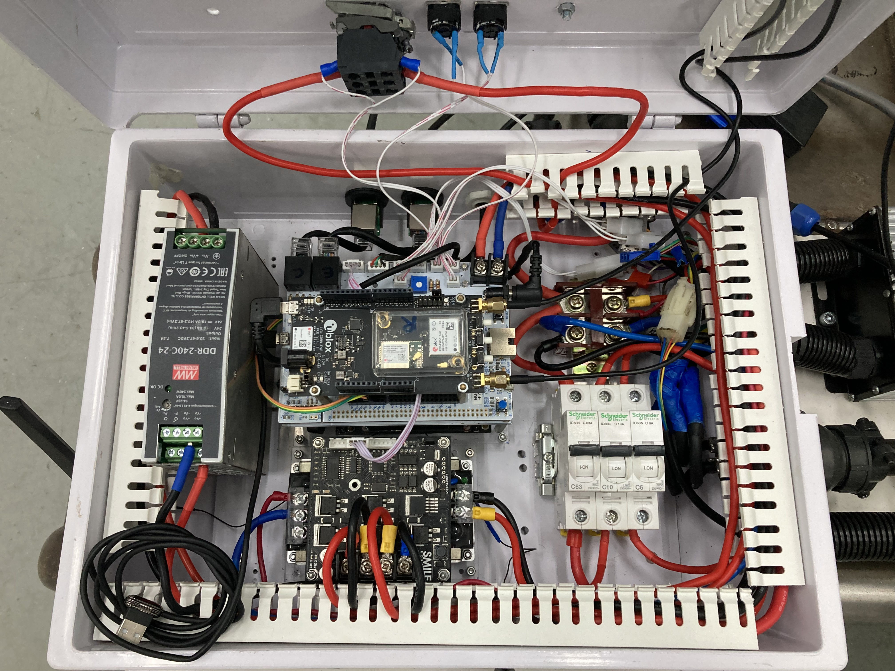

# Portfolio

## 2025
<!-- ### Wellsite Inspection using Quadrupled Robot Platform @ PTTEP -->

### Body Tracking Application
Since FIBO Industry Service acquired Unitree H1 and G1 robots, the team continued to focus on the development and application of humanoid robots. One simple application was to use ORBTEC Femto Bolt along with Azure Body Tracking SDK to transfer operator's joint angles to the robot. I modified existing source code to make it work with the actual G1 humanoid.

{width=400 loading=lazy}

### Exploring about Fleet System
To make the robots work collaboratively, I delved further into fleet systems. First, I developed an application to control several robots at once to test the robustness of the communication channel. Then, I utilized the networkx library to instantiate a directional graph for robots to travel step-wise.

<!-- {width=325} -->
<!-- {width=325} -->
{loading=lazy}
{loading=lazy}

## 2024
### Container Inspection Robot @ PTTGC
Our team continued working on a container inspection robot for PTT Global Chemical (PTTGC). It is used for predictive maintenance by inspecting container thickness. The rover was designed with three wheels for navigating over cylindrical tanks and sphere-shaped vessels. In this project, using ros_control, I devised a new tricycle control strategy, coined the "Energy Shaping Method". The idea was simple: one analog input was used for defining the total energy (i.e., throttle) and another was used for "shaping" the proportion between linear energy and angular energy.

{width=300 loading=lazy}
{width=300 loading=lazy}

In this project, I also took the opportunity to explore how to "deproject" wheel odometry onto a sphere surface, from which I learned a lot by utilizing the Eigen library.

<!-- {width=400} -->

I also made use of ANN for battery estimation. We used the dataset from electronic load to obtain the SOC time series along with voltage and current profiles. According to the histogram, the error bound is around ±2%.

{width=240 loading=lazy}
{width=240 loading=lazy}
{width=160 loading=lazy}

This project turned out to be very successful after going through several design iterations.

{width=175 loading=lazy}
{width=250 loading=lazy}
{width=250 loading=lazy}

[Facebook PR](https://web.facebook.com/share/p/19rnyNXkDo/?mibextid=wwXIfr)

### Golf Cart Modification @ YAMAHA
In this project, we provided engineering services to modify an existing golf cart to allow autonomous navigation. The system comprised three main components: a traction drive, steering, and a brake that used a linear actuator. Communication with such a system was not simple; it required a complex state machine, especially for handling communication loss. The system also featured redundant control which made the system robust against computer failure.

{loading=lazy}
{width=250 loading=lazy}
<!-- {width=350} -->

### Surveillance Machine Investigating Live Environment (SMILE) Robot @ Siam Paragon
After we accomplished the NECTEC robot, we continued to work on a surveillance robot that operated inside Siam Paragon Shopping Center. The robot was used for measuring PM2.5, detecting water spills, and identifying fire incidents. We added several features on top of the existing ones, e.g., elevator transit module (consisting of point cloud matching and pose controller modules), scheduler module, status manager, media player, etc. With experience from past projects, I managed to establish the FIBO Autonomous Robot (FAR) project. The purpose was to mitigate the problem of deploying the system into new robots with an easy-to-configure process.

{width=350 loading=lazy}
{width=350 loading=lazy}
{width=350 loading=lazy}
{width=350 loading=lazy}

[PR Video](https://youtu.be/YrrubN9I7dY?si=gS9XQwE3hs_vqgCZ)

## 2023
### Autonomous Mobile Manipulator Robot @ NECTEC
For this project, there was a requirement to create an autonomous programmable mobile manipulator for the National Electronics and Computer Technology Center (NECTEC). The software architecture was divided into three parts: frontend, vision, and ROS, which were under my responsibility. To make it programmable, I employed the concept of behavior trees and integrated it with a Blockly application. As a result, the robot still runs stably at the customer's site.

{width=300 loading=lazy}
{width=300 loading=lazy}

### Journey & Global Partnership Mobile Robots
After I graduated with my master's degree, I continued working with FIBO Industry as a software supervisor. My first work was to continue integrating fundamental components into mobile robots that were missing in the SOFA robot. These included integration with IMU (using robot_localization), hardware abstraction (using ros_control), and robust navigation (with teb_local_planner). We also collaborated (with Poj) to create the first robot interface using the Android framework.

{width=250 loading=lazy}
{width=175 loading=lazy}
{width=250 loading=lazy}

## 2022
### Completion of An Autonomous Robot for Land Surface Preparation in Salt-Farming Thesis
In this year, I dedicated my time to completing the thesis. I started with mechanical modifications by having my friend (Lerng) weld a steering motor stand and a battery rack. A shop overseer (P' Neng) also helped me create custom couplings as connectors between encoders and actuator shafts. They also gave me advice on integrating the transmission system.

{width=175 loading=lazy}
{width=200 loading=lazy}
{width=300 loading=lazy}

{width=175 loading=lazy}
{width=250 loading=lazy}

Meanwhile, I developed three circuit boards: one motor controller and two I2C extender boards. The purpose of these I2C extenders was to extend the communication of the encoder that reads steering angle and the current heading. Then, I integrated all components together in a control box which also includes an RTK module, circuit breakers, a contactor, etc. I also managed to crimp and install the connectors using IP67-compliant components.

{width=250 loading=lazy}
{width=300 loading=lazy}
{width=300 loading=lazy}
{width=300 loading=lazy}

Then, I created two additional pieces of equipment. The first one is an RTK pole. It is used as a base station, sending positional correction signals to the rover. The other is a tripod equipped with a RealSense D435 camera. With the RANSAC algorithm, it can determine surface roughness.

{width=175 loading=lazy}
{width=300 loading=lazy}

Before moving to the real site, I performed an experiment at FIBO parking lot using Marvelmind beacons to measure the localization performance of the GPS/RTK module.

{width=500 loading=lazy}

{width=175 loading=lazy}
{width=300 loading=lazy}

After the field test at the parking lot was completed, we moved it to the actual salt-farm field to perform real-world scenarios. It turned out that the vehicle could run at an adequate performance level.

{width=250 loading=lazy}
{width=300 loading=lazy}

Many people gathered to witness the accomplishment of the vehicle. One of them even asked for two more to be created. The third person from the right was my nephew (R Sarai) who generously lent us the vehicle for modification. In the right photo, I'd like to give credit to my father (left) for the idea of an autonomous clay roller and my grandfather (right) who had been working in the salt-farming industry for decades.

{width=300 loading=lazy}
{width=300 loading=lazy}

I'd like to express my gratitude to Assoc. Prof. Dr.Djitt Laowattana, Dr. Prakankiat Youngkong and Asst. Prof. Dr. Thawida Maneewan for invaluable advice. Also, I'd like to thank to Agricultural Research Development Agency in Thailand and King Mongkut’s University of Technology Thonburi for funding and promoting my work.

[Thesis Manuscript](artifacts/03_master/thesis.pdf){:download}

[University PR (Thai)](https://www.kmutt.ac.th/news/05/09/2022/23152/) / [Translated Version](artifacts/03_master/translated_news.pdf){:download}

## 2021
### MINERVA: A 6U Nanosatellite with an Autonomous Intelligent Biological Operating System (AIBO) for Deep-Space Experiment
In the meantime, I collaborated with the Mahidol University team to participate in the 7th Mission Idea Contest for Deep Space Science and Exploration in Tokyo, Japan. I contributed to the simulation of the NRHO orbit. As a result, we won 2nd place in the competition. 

{width=325 loading=lazy}
{width=325 loading=lazy}

[7th Mission Idea Contest Homepage](https://www.spacemic.net/index7.html)

### Complete Coverage Navigation for Autonomous Clay Roller in Salt-Farming Application Paper
After I gained enough understanding of all building blocks for completing the thesis, I implemented and simulated complete coverage navigation algorithms specifically designed for the clay roller. Gazebo was the simulation platform for the task.

{width=800 loading=lazy}
{width=300 loading=lazy}

[Conference Paper Website](https://ieeexplore.ieee.org/document/9519339) / [Presentation Slide](artifacts/03_master/ccn_presentation.pdf){:download}

### FIBO Against COVID–19 (FACO) Project
During the COVID-19 pandemic, I continued my role as a software developer on the SOFA robot, part of the FACO project. The purpose of the project was to minimize the risk of medical personnel being exposed by utilizing autonomous mobile robot technologies. A series of robots were deployed in 7 hospitals in Thailand.

{width=350 loading=lazy}
{width=200 loading=lazy}

{width=300 loading=lazy}
{width=325 loading=lazy}

[News about FACO Project (Thai)](https://www.salika.co/2020/04/09/faco-robot-gangster-fight-covid-from-fibo/)

## 2020
### STM32 Motor Controller Board & Miniature ARIS Robot
To gain readiness before modifying an existing clay roller, I implemented two prototypes for educational purposes: an STM32 motor controller and a miniature version of a clay roller. I learned how to implement position-controlled and velocity-controlled actuators. I also developed skills using shop equipment such as a drill, laser cutter, lathe machine, etc. Consequently, I managed to make a miniature robot move using a joystick.

{width=300 loading=lazy}
{width=275 loading=lazy}

### Story of FIBO Android (SOFA) Robot
To celebrate the 25th anniversary of FIBO's establishment, a robot called SOFA was built. I was invited to become a freelance software engineer, developing mobile base servo communication, teleoperation, and a follow-me module for FIBO Industry Service.

{width=400 loading=lazy} {width=200 loading=lazy}

### Graduate Research Scholarship in Agriculture and Agricultural Industry
The research scholarship was awarded by Agricultural Research Development Agency, Minister of Agriculture and Cooperatives, Minister of Agriculture and Cooperatives, Thailand.

[Award Announcement (Thai)](artifacts/03_master/arda_award_announcement.pdf){:download}

## 2019
### APSCO Microsatellite Challenge in Xi'an
As a team from Thailand, I collaborated with Thai team to compete the APSCO Microsatellite Challenge. It was held October 31 - November 1, Xi’an, China, with cooperation from Northwestern Polytechnical University (NPU).

{width=600 loading=lazy}

### APSCO 3rd SSS Summer Camp in Shanghai
I was also appointed to join the 3rd SSS Summer Camp. It was held July 15 – August 2, 2019 in Shanghai, China, in cooperation with Shanghai Jiaotong University. It focused on satellite assembly, integration, and testing segments.

{width=600 loading=lazy}

### Pursuing Master Degree at FIBO, working on ARIS
I pursued a master's degree in Robotics and Automation at the Institute of Field Robotics (FIBO), King Mongkut's University of Technology Thonburi, to start working on "An Autonomous Robot for Land Surface Preparation in Salt-Farming" (ARIS) thesis. The approach was to modify an existing clay roller so it could operate autonomously.

{width=450 loading=lazy}

## 2018
### APSCO 2nd SSS Summer Camp in Ankara
I also participated in the 2nd SSS Summer Camp. It was held July 23 – August 10, 2018 at Middle East Technical University, Ankara, Turkey. The training focused on unit/subsystem manufacturing and testing.

{width=600 loading=lazy}

### The Best Team Winner - Azure Inspire 2018 : Geek-a-Thon
I led a startup team by creating an application that leveraging Azure’s Custom Vision image classifier for preliminary skin disease diagnostics.

{width=300 loading=lazy}
{width=370 loading=lazy}

### Communication Engineering Senior Project
I analyzed, designed, and validated FR4-based microstrip phased-array antennas of various configurations, including 1×1, 1×2, and 2×2 arrays. Additionally, I investigated the effects of phasing phenomena by applying the feed translation technique for beam steering performance comparison.

{width=300 loading=lazy}
{width=375 loading=lazy}

[Final Report](artifacts/01_bachelor/senior_project.pdf){:download} / [Presentation Slide](artifacts/01_bachelor/slide.pdf){:download}

## 2017
### APSCO 1st SSS Summer Camp in Ankara
I participated in the 1st SSS Summer Camp as a delegate from Thailand. It was held August 14 – September 2, 2017 at Beihang University, Beijing, China. The training covered over 13 topics and was given to nearly 40 students from member states of APSCO. The courses covered the basic technology of small satellites and established the foundation for future project development.

{width=600 loading=lazy}

### Internship at Silicon Craft Technology
After I won the CU Mini Design Challenge, I was invited to join Silicon Craft Technology, Bangkok. The internship was divided into 2 parts: the design of Two-stage Op-Amp and the implementation of AES cipher suite.

{width=300 loading=lazy}
{width=300 loading=lazy}
{width=300 loading=lazy}
{width=300 loading=lazy}

[Internship Report (Thai)](artifacts/02_internship/interns_report.docx){:download}

### Solo Champion - CU Mini Design Challenge
I implemented various hardware logic, i.e., UART transceiver, a sine wave generator, and a PCM audio player on a Spartan-3 FPGA board using VHDL language. The competition was held in pairs but I wasn't able to find a partner eventually.

{width=600 loading=lazy}

## 2015-2016
I pursued a bachelor's degree in engineering at Chulalongkorn University, then specialized in Electrical Engineering with a Communication major and Electronics minor. In addition to Electrical Engineering, I took extra courses from the Computer Engineering department. During that time, I also joined the CU Potential Club.

{width=450 loading=lazy}