# Prior Projects

## 2025
<!-- ### Wellsite Inspection using Quadrupled Robot Platform @ PTTEP -->

### Body Tracking Application
Since FIBO Industry Service has got Unitree H1 and G1 robot, the team continue to focus on the developement and the application of humanoid robots. One simple application was to use ORBTEC Femto Bolt along with Azure Body Tracking SDK to transfer operator's joint angle to the robot. I modified an existing source code to make it work with the actual G1 humanoid.
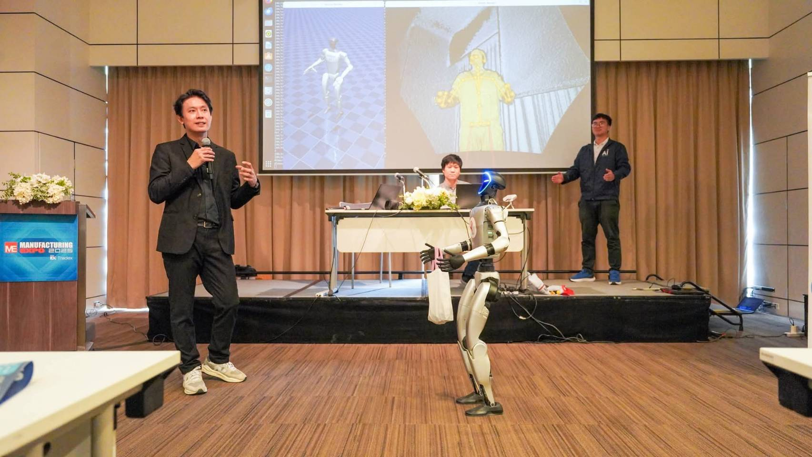{width=400}

### Exploring about Fleet System
To make the robot working collaboratively, I delve further into fleet system. Firstly, I developed an application to control several robot at once to test the robustness of the communication channel. Then, I utilized networkx library to instantiate a directional graph for robots to travel step-wise.
{width=300}
{width=300}

## 2024
### Container Inspection Robot @ PTTGC
Our team continued on working with a container inspection robot for PTT Global Chemical (PTTGC). It is used for predictive maintenance by inspecting container's thickness. The rover was designed with three wheels for navigating over a cylindrical tank and a sphere-shaped vessel. In this project, using ros_control, I devised a new tricycle control strategy, coined as "Energy Shaping Method". The idea was simple: one analog was used for defining the total energy i.e. throttle and another one was used for "shaping" the proportional between linear energy and angular energy.

{width=300}
{width=300}

In this project, I also took an opportunity to explore on how to "deproject" wheel odometry onto a sphere surface in which I gained a lot from utilizing Eigen library.

{width=400}

Also, I made use of ANN for battery estimation. We used the dataset from electronic load to obtain the SOC timeseries along with voltage and current profile. According to the histogram, the error bound is around +-2%

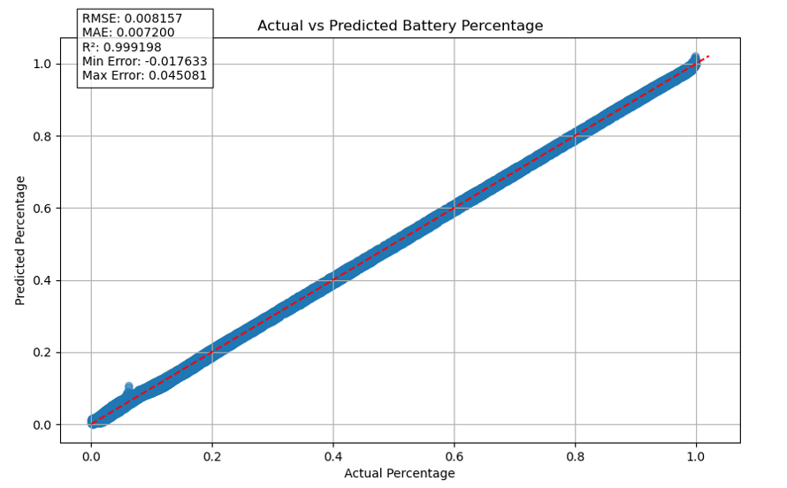{width=240}
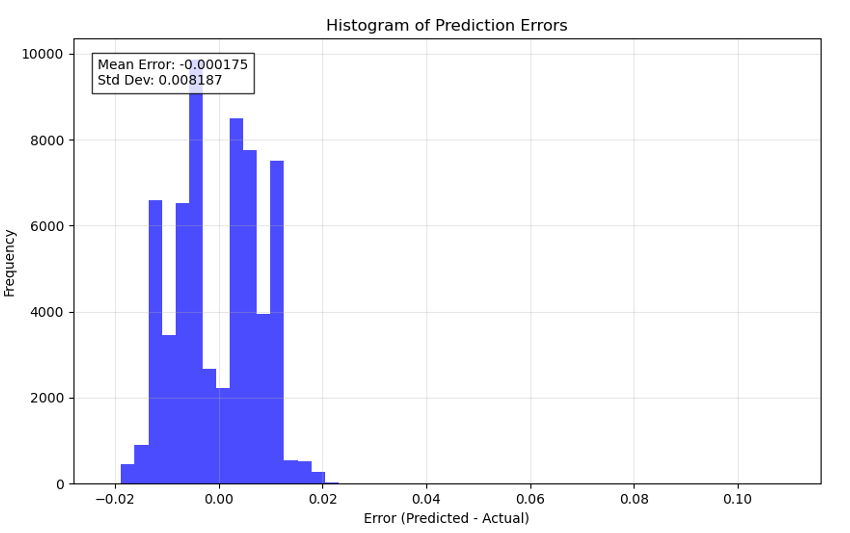{width=240}
{width=160}

This project turns out to be a very successful one after been through several design iterations.
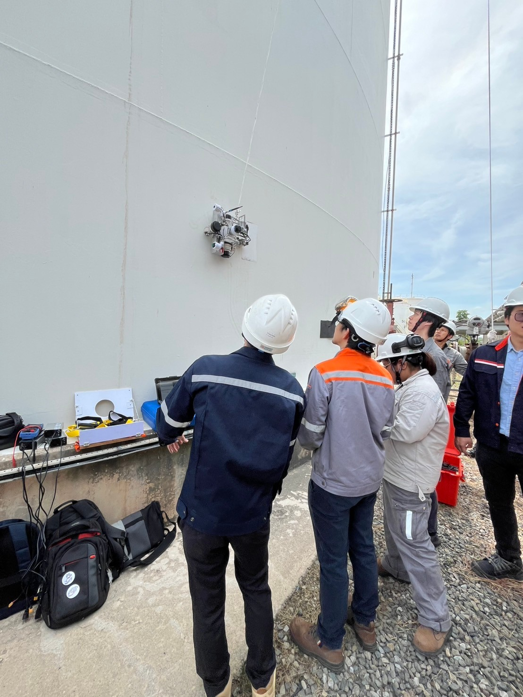{width=175}
{width=250}
{width=250}

[Facebook PR](https://web.facebook.com/share/p/19rnyNXkDo/?mibextid=wwXIfr)

### Golf Cart Modification @ YAMAHA
In this project, we provided the engineering service to modify an existing golf cart to allow autonomous navigation. The system comprised of three main components, a traction drive, a steering, and a brake that used a linear actuator. Communication with such a system was not that simple, it required complex state machine especially handling communciation loss. The system also features redundant control which made the system prone to computer failure.
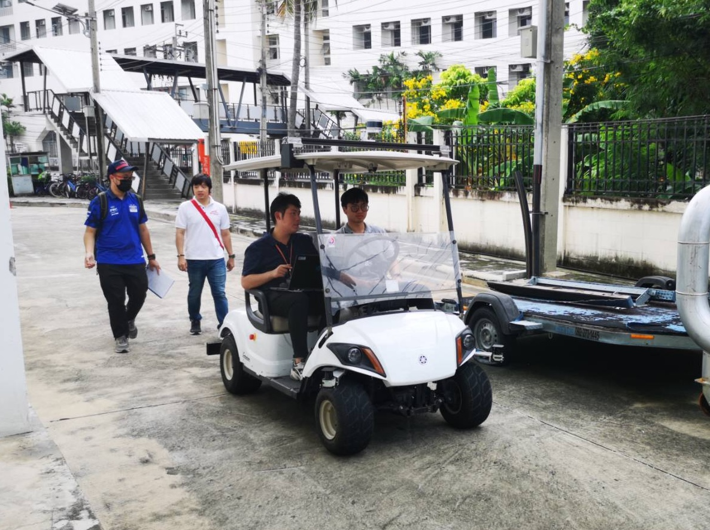{width=250}
{width=350}

### Surveillance Machine Investigating Live Environment (SMILE) Robot @ Siam Paragon
After we had accomplished the NECTEC robot, we continued to work on a surveillance robot that worked inside Siam Paragon Shopping Center. The robot was used for measuring PM2.5, detecting water spilled and identifying fire incidents. We added couple features on top existing one e.g. elevator transit module(consisted of pointcloud matching and pose controller modules), scheduler module, status manager, media player, etc. With experiences from past projects, I managed to established FIBO Autonomous Robot (FAR) project. The purpose was to mitigate the problem of deploying the system into new robot with easy-to-configure process.

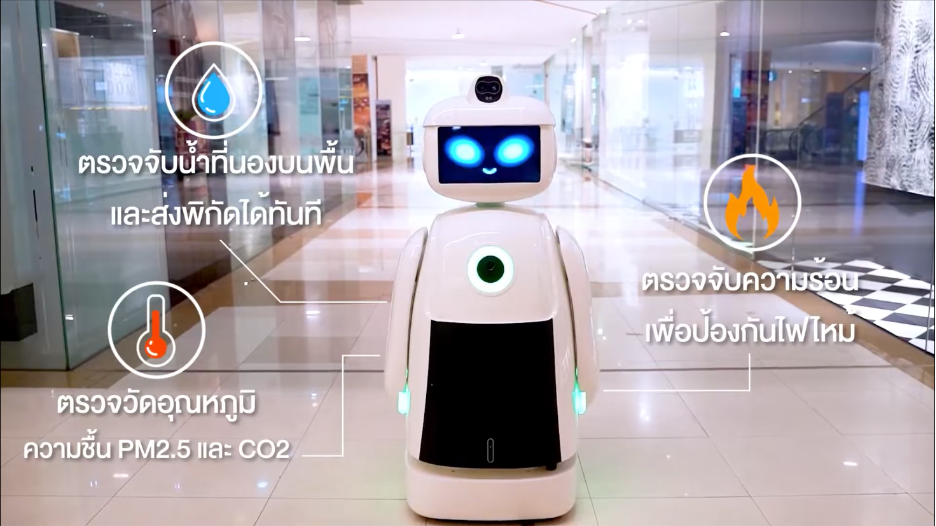{width=350}
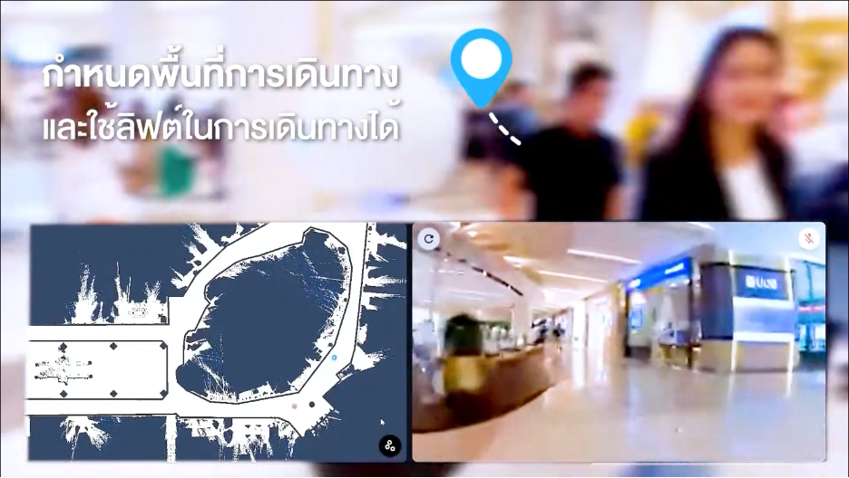{width=350}
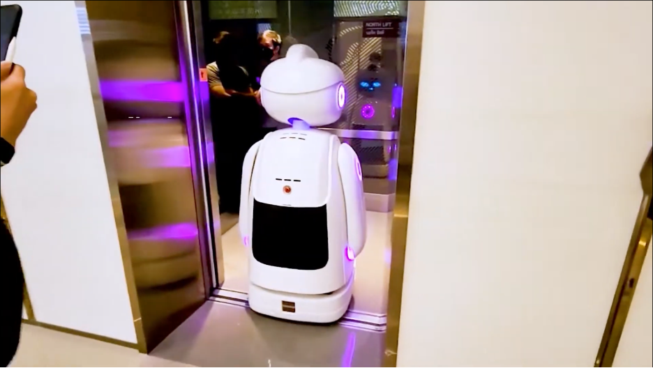{width=350}
{width=350}

[PR Video](https://youtu.be/YrrubN9I7dY?si=gS9XQwE3hs_vqgCZ)

## 2023
### Autonomous Mobile Manipulator Robot @ NECTEC
For this project, there was a requirement to make an autonomous programmable mobile manipulator for National Electronics and Computer Technology Center (NECTEC). The software architecture was divided into three parts: frontend, vision and ROS which was under my resposibility. To make it programmable, I employed the concept of behavior tree and integrated with blockly application. As a result, the robot still run stably at customer's site.

{width=300}
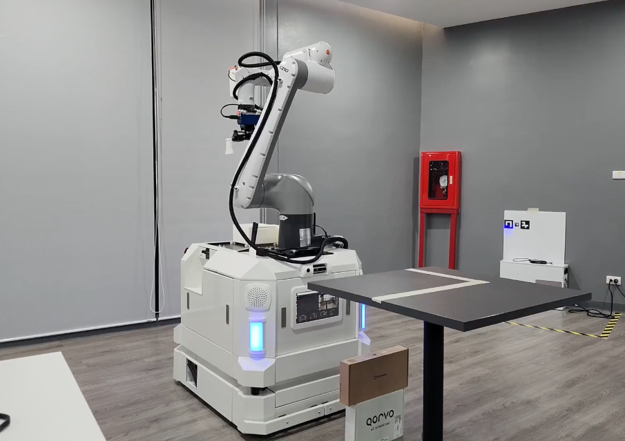{width=300}

### Journey & Global Partnership Mobile Robots
After I graduated my master's degree, I continued working with FIBO Industry as a software supervisor. My first work was to continue integrating fundamental components into mobile robot that were missing in the SOFA robot. These included integration with IMU (using robot_localization), hardware abstraction (using ros_control) and robust navigation (with teb_local_planner). We also collaborated (with Poj) to create the first robot interface using Android framework.

{width=250}
{width=175}
{width=250}

## 2022
### Completion of An Autonomous Robot for Land Surface Preparation in Salt-Farming Thesis
In this year, I dedicated my time on completing the thesis. I started with mechanical modification by having my friend (Lerng) welding a steering motor stand and a battery rack. A shop overseer (P' Neng) also helped me creating custom couplings as a connector between encoders and actuator shafts. They also gave me advice on integrating transmission system.

{width=175}
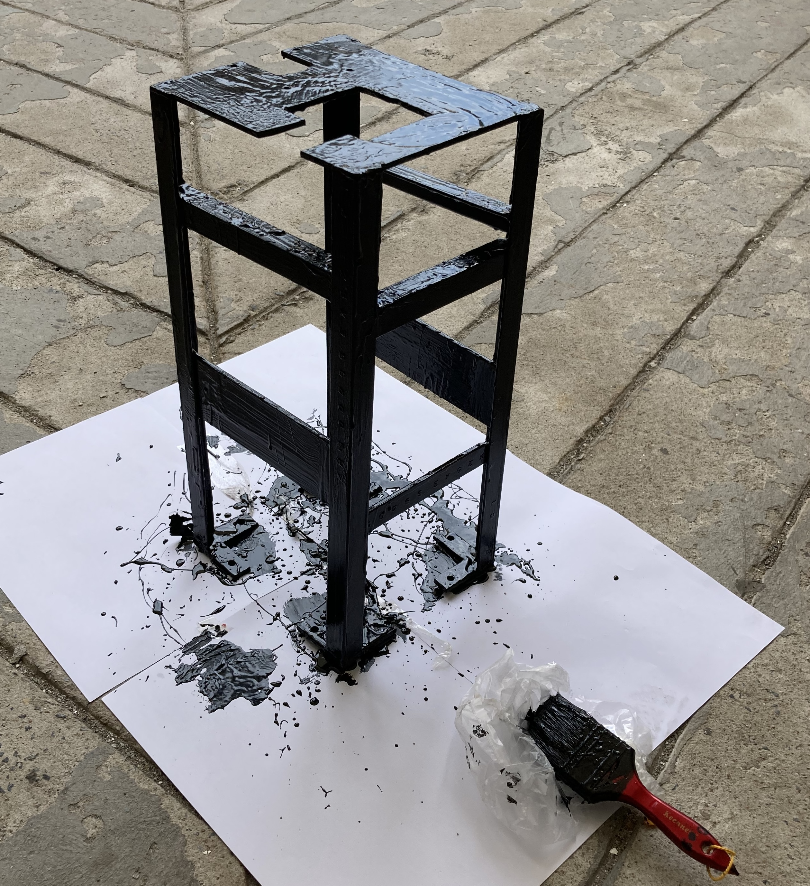{width=200}
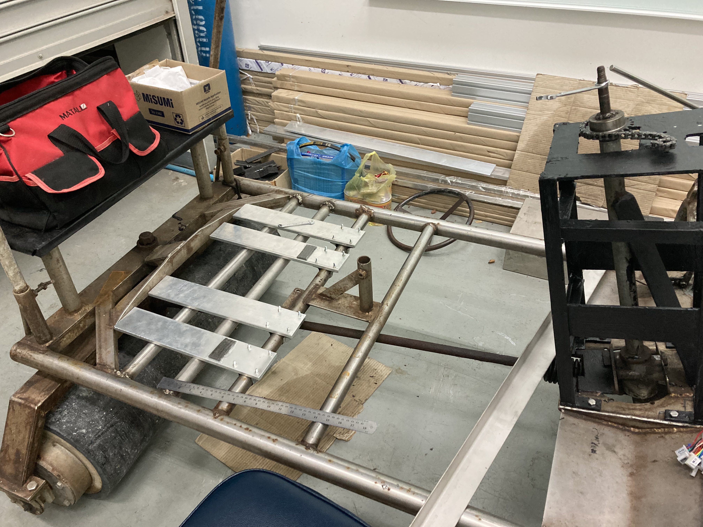{width=300}

{width=175}
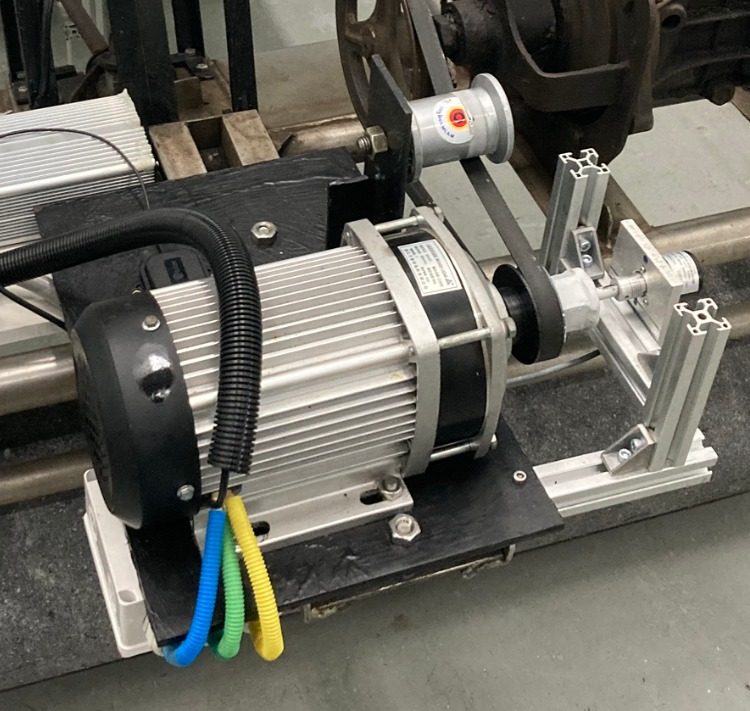{width=250}

Meanwhile, I developed three circuit boards, one motor controller and two I2C extender boards. The purpose of these I2C extenders were to extend the communication of the encoder that read steering angle and the current heading. Then, I integrated all component altogether in a control box which also includes an RTK module, circuit breakers, a contractor, etc. I also managed to crimp and install the connectors by using IP67-compliant components.

{width=250}
{width=300}
{width=300}
{width=300}

Then, I created two further equipments. First one is an RTK pole. It is used as a base station, sending the positional correction signal to the rover. Another one is a tripod equipped with Realsense D435 camera. With RANSAC algorithm, it can find surface roughness.

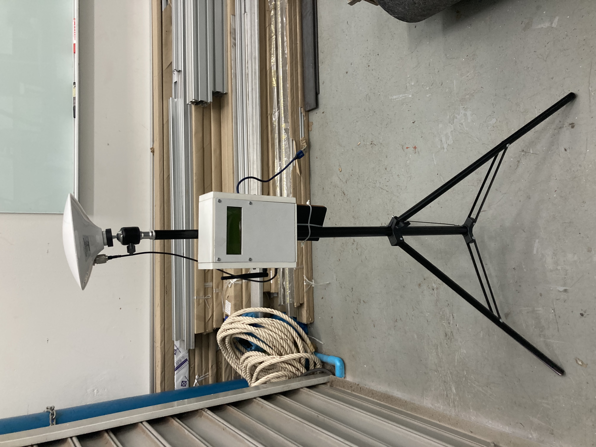{width=175}
{width=300}

Before moving to the real site, I performed an experiment at FIBO parking lot using Marvelmind beacons to measure the localization performance of the GPS/RTK module.

{width=500}

{width=175}
{width=300}

After the field test at the parking lot was completed, we moved it the the actual salt-farm field to perform real-world scenario. It turned out that the vehicle can run at adequate level performance.

{width=250}
{width=300}

Many people were gathered to witness the accomplishment of the vehicle. One of them even asked for creating two more. The third person from the right was my nephew(R Sarai) who generously lent us the vehicle for modification. In the right photo, I'd like to give the credit to my father(left) for the idea of autonomous clay roller and my grandfather(right) who had been working with the salt-farming industries for decades.

{width=300}
{width=300}

I'd like to express my gratitude to Assoc. Prof. Dr.Djitt Laowattana, Dr. Prakankiat Youngkong and Asst. Prof. Dr. Thawida Maneewan for invaluable advice. Also, I'd like to thank to Agricultural Research Development Agency in Thailand and King Mongkut’s University of Technology Thonburi for funding and promoting my work.

[Thesis Manuscript](artifacts/03_master/thesis.pdf){:download}

[University PR (Thai)](https://www.kmutt.ac.th/news/05/09/2022/23152/) / [Translated Version](artifacts/03_master/translated_news.pdf)

## 2021
### MINERVA: A 6U Nanosatellite with an Autonomous Intelligent Biological Operating System (AIBO) for Deep-Space Experiment
In the mean time, I collaborated with Mahidol University Team to participate the 7th Mission Idea Contest for Deep Space Science and Exploration, Tokyo, Japan. I contributed in the simulation of the NRHO orbit. As a result, we won the 2nd place in the competition. 

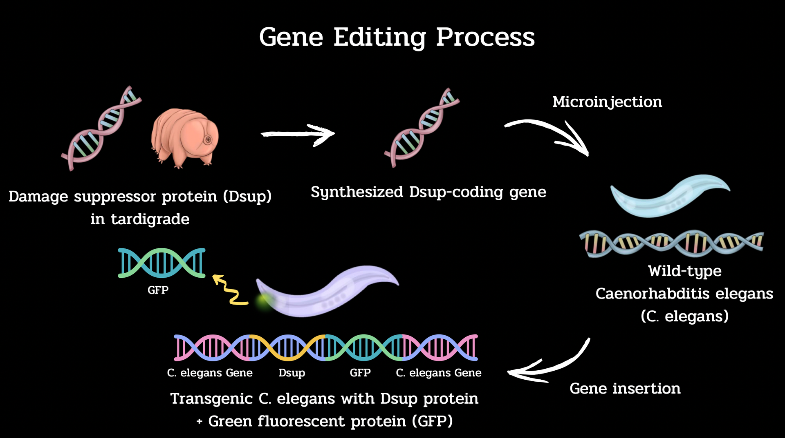{width=325}
{width=325}

[7th Mission Idea Contest Homepage](https://www.spacemic.net/index7.html)

### Complete Coverage Navigation for Autonomous Clay Roller in Salt-Farming Application Paper
After I gained enough understanding of all building blocks for creating completing the thesis, I implemented and simulated the complete coverage navigation algorithms that specifically designed for the clay roller. Gazebo was the simulation platform for the task.

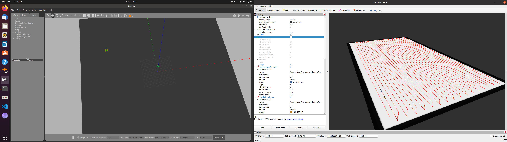{width=800}
{width=300}

[Conference Paper Website](https://ieeexplore.ieee.org/document/9519339) / [Presentation Slide](artifacts/03_master/ccn_presentation.pdf)

### FIBO Against COVID–19 (FACO) Project
During COVID-19 pandemic, I continued my role as a software developer on SOFA robot, a part of FACO project. The purpose of the project was to minimize the risk of medical personnels being exposed, by utilizing the autonomous mobile robot technologies. A series of robots had been deployed 7 hospitals in Thailand.

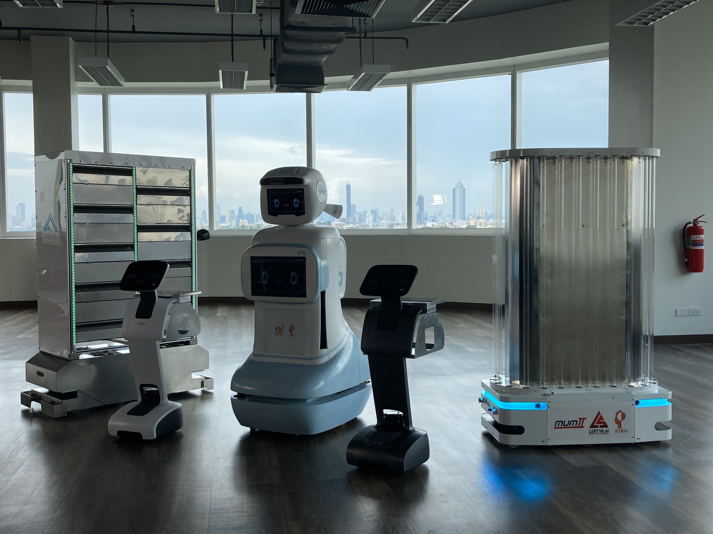{width=350}
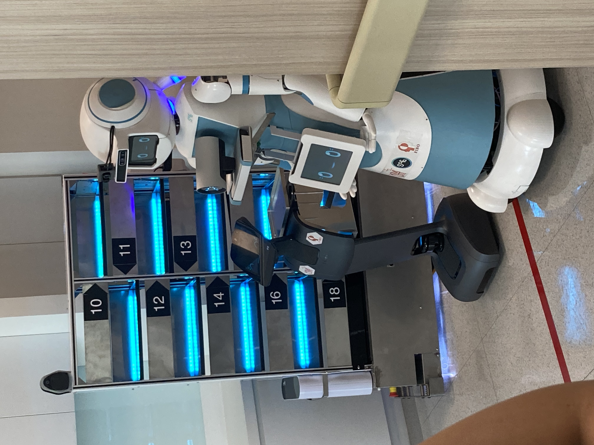{width=200}

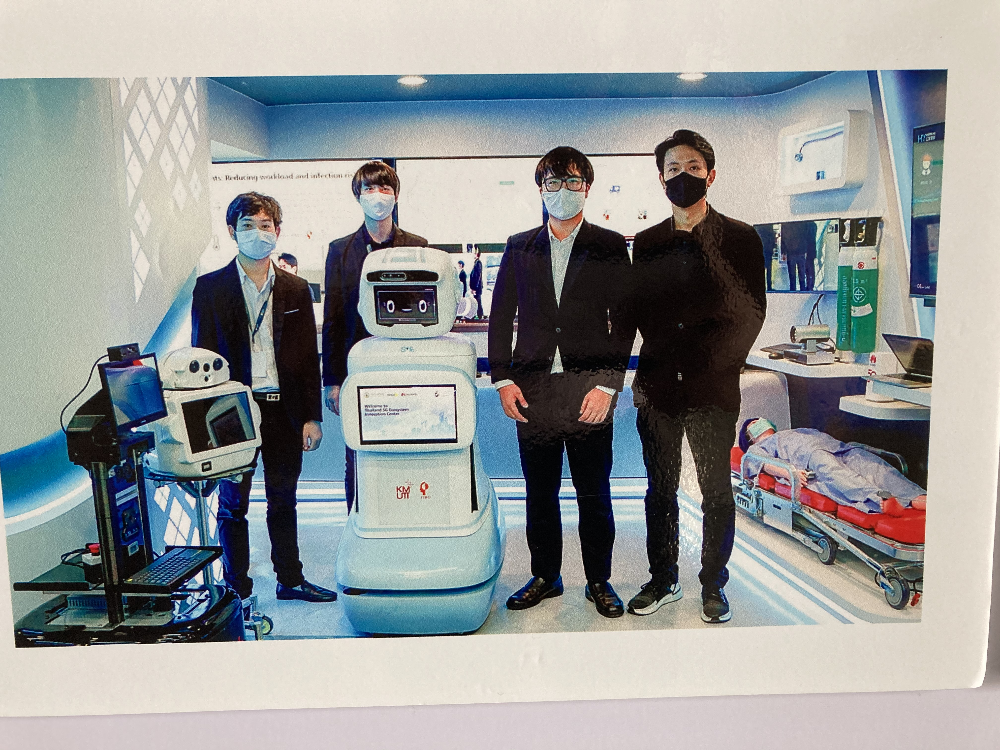{width=300}
{width=325}

[News about FACO Project (Thai)](https://www.salika.co/2020/04/09/faco-robot-gangster-fight-covid-from-fibo/)

## 2020
### STM32 Motor Controller Board & Miniature ARIS Robot
To gain readiness before modifying an existing clay roller, I implemented two prototypes for educational purpose, an STM32 motor controller a miniature version of a clay roller. I learned on how to implement a position controlled and velocity controlled actuator. Also, I developed some skills using shop equipment such as a driller, a laser cutter, a lathe machine, etc. Consequently, I managed to make a miniature robot move using a joystick.

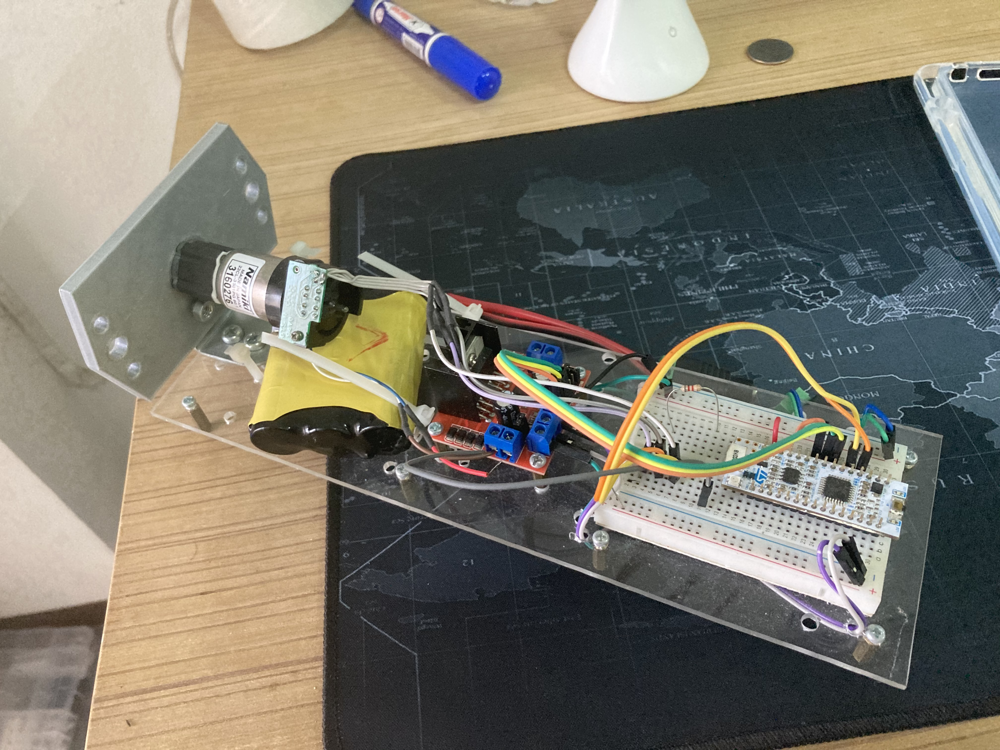{width=300}
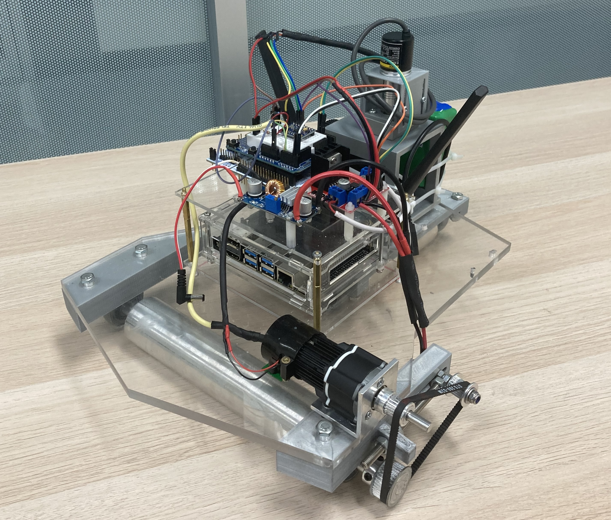{width=275}

### Story of FIBO Android (SOFA) Robot
To celebrate for 25-Year of FIBO establishment, a robot called SOFA was built. I was invited to become a freelance software engineer, developing a mobile base servo communciation, a teleoperation and a follow-me module for FIBO Industry Service.

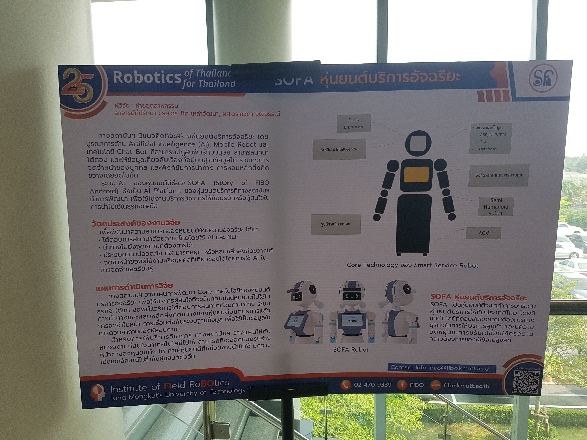{width=400} {width=200}

### Graduate Research Scholarship in Agriculture and Agricultural Industry
The research scholarship was awarded by Agricultural Research Development Agency, Minister of Agriculture and Cooperatives, Minister of Agriculture and Cooperatives, Thailand.

[Award Announcement (Thai)](artifacts/03_master/arda_award_announcement.pdf)

## 2019
### APSCO Microsatellite Challenge in Xi'an
As a team from Thailand, I was also appointed to join the 3st SSS Summer Camp. It was held October 31 - November 1, Xi’an, China, with cooperation from Northwestern Polytechnical University (NPU).

{width=600}

### APSCO 3rd SSS Summer Camp in Shanghai
I was also appointed to join the 3st SSS Summer Camp. It was held July 15 – August 2, 2019 in Shanghai, China, with cooperation from Shanghai Jiatong University. it focus on satellite assembly, integration and testing segment

{width=600}

### Pursuing Master Degree at FIBO, working on ARIS
I pursued a master degree in Robotics and Automation at Institute of Field Robotics(FIBO), King Mongkut's University of Technology Thonburi to start working on "An Autonomous Robot for Land Surface Preparation in Salt-Farming" (ARIS) thesis. The approach was to modify an existing clay roller so it could operate driverless.

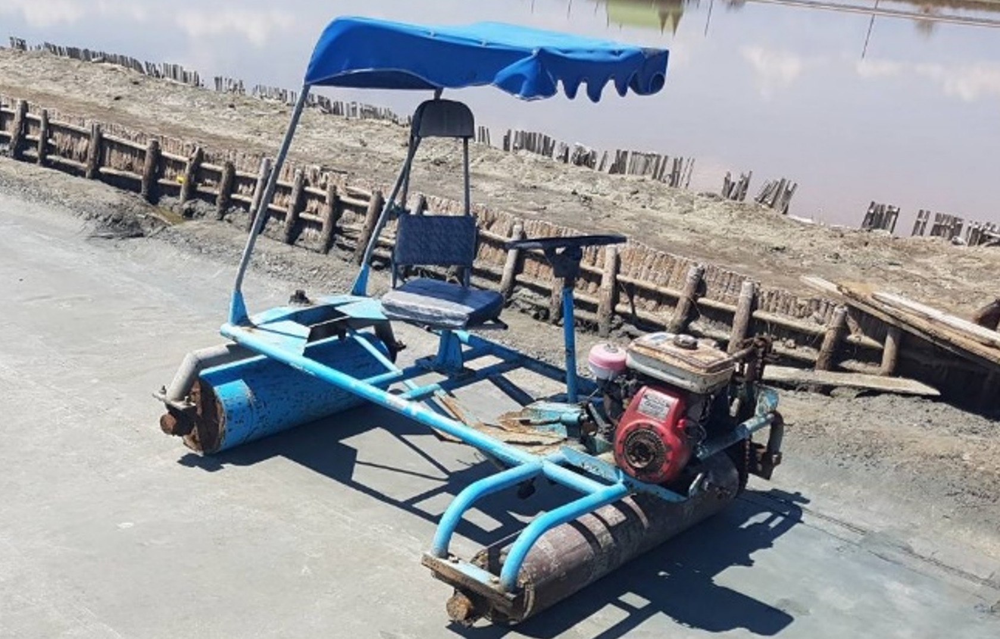{width=450}

## 2018
### APSCO 2nd SSS Summer Camp in Ankara
I also participated the 2st SSS Summer Camp. It was held July 23 – August 10, 2018 in middle East Technology University, Ankara, Turkey. The training focused on unit/subsystem manufacturing and testing.

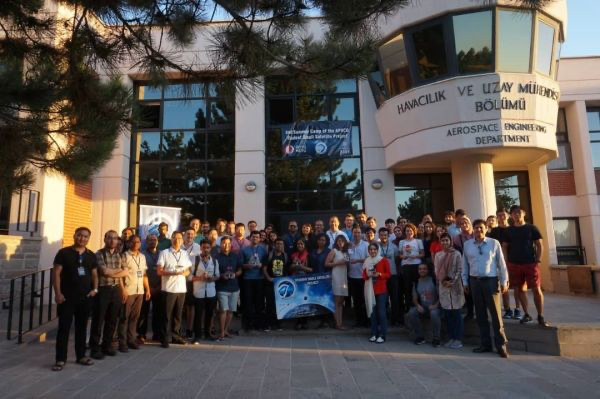{width=600}

### The Best Team Winner - Azure Inspire 2018 : Geek-a-Thon
I led a startup team by creating an application that leveraging Azure’s Custom Vision image classifier for preliminary skin disease diagnostics.

{width=300} {width=370}

### Communication Engineering Senior Project
I analyzed, designed, and validated FR4-based microstrip phased-array antennas of various configurations, including 1×1, 1×2, and 2×2 arrays. Additionally, I investigated the effects of phasing phenomena by applying the feed translation technique for beam steering performance comparison.

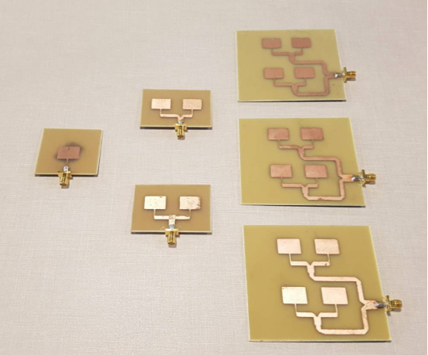{width=300} {width=375}

[Final Report](artifacts/01_bachelor/senior_project.pdf){:download} / [Presentation Slide](artifacts/01_bachelor/slide.pdf){:download}

## 2017
### APSCO 1st SSS Summer Camp in Ankara
I participated the 1st SSS Summer Camp as a delegate of Thailand. It was held August 14 – September 2, 2017 in Beihang University, Beijing, China. The training covered over 13 topics and was given to nearly 40 students from Member States of APSCO. The courses covered the basic technology of small satellite, and established the foundation for the project development in the future.

{width=600}

### Internship at Silicon Craft Technology
After I won the CU Mini Design Challenge, I was invited to join Silicon Craft Technology, Bangkok. The internship was divided into 2 parts: the design of Two-stage Op-Amp and the implementation of AES cipher suite.

{width=300}
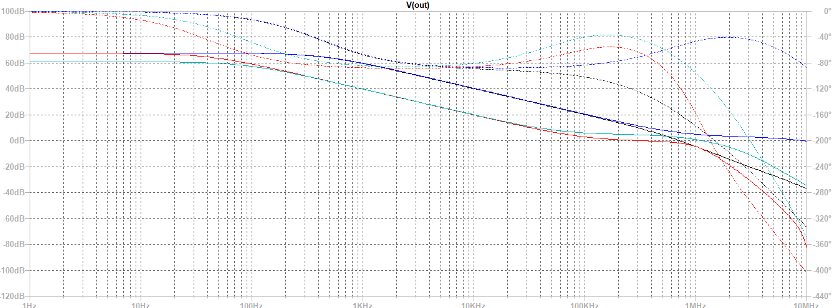{width=300}
{width=300}
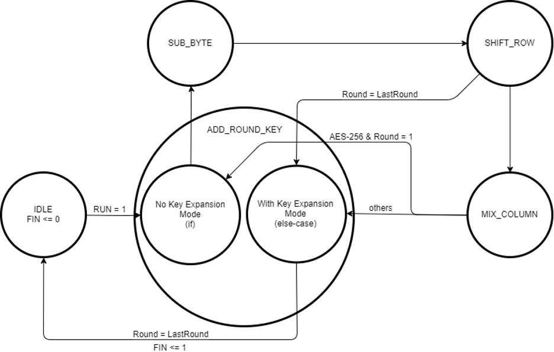{width=300}

[Internship Report (Thai)](artifacts/02_internship/interns_report.docx)

### Solo Champion - CU Mini Design Challenge
I implemented various hardware logic i.e., UART tranceiver, a sine wave generator, and a PCM audio player on a Spartan-3 FPGA board using VHDL language. The competition was held in pair but I wasn't able to find a partner eventually.

{width=600}

## 2015-2016
I pursued a bachelor degree in engineer at Chulalongkorn University then specialize in Electrical Engineering with Communication major and Electronics minor. In addition to Electrical Engineer, I took extra courses from Computer Engineering department. During that time, I also join CU Potential Club.

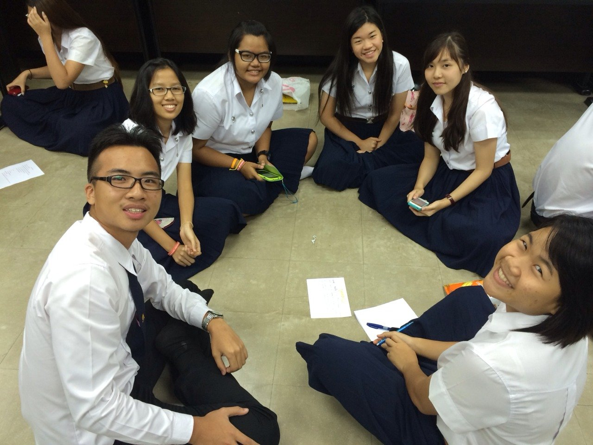{width=450}